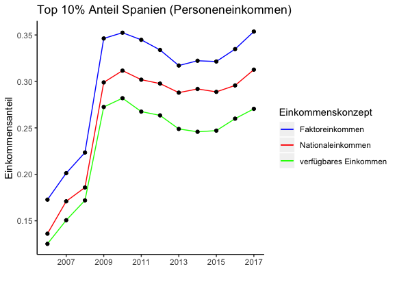
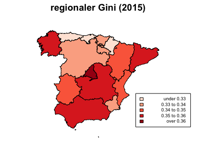

```{r setup, include=FALSE}
knitr::opts_chunk$set(echo = TRUE)
```

\newpage

# 1. Einleitung

Einkommensverteilung und Einkommensungleichheit haben in den vergangenen Jahren in der Forschung zunehmend an Bedeutung gewonnen. Zahlreiche Studien widmen sich der Einkommensverteilung bestimmter Länder, verschiedenen Ungleichheitsmaßen wie etwa dem Gini und der Entwicklung von Einkommensungleichheit über die Zeit. Diese Seminararbeit beschäftigt sich mit der Einkommensverteilung in Spanien und geht im Zuge dessen auf Spezifika der spanischen Einkommensungelichheit ein, zeigt verschiedene Ungleichheitsindikatoren und deren Entwicklung auf und greift schließlich noch regionale Unterschiede in Einkommen und Ungleichheit auf. Im ersten Teil wird die aktuelle Situation der Einkommensungleichheit und deren Entwicklung kontextualisiert und anhand von wichtigen Einflussfaktoren charakterisiert. Diese Einflussfaktoren sollen zum besseren Verständnis der länderspezifischen Ungleichheit Spaniens beitragen. Darüber hinaus wird kurz skizziert, wie sich die Krise 2007/2008 auf diese Faktoren ausgewirkt hat. Der zweite Teil geht anschließend auf eigene empirische Ergebnisse. Anhand mehrerer Indikatoren (z.B.: Gini Koeffizient) wird mittels EU-Silc Daten die aktuelle Situation und die Entwicklung im Zeitraum von 2006 bis 2017 der Einkommensungleichheit Spaniens aufgezeigt. Zusätzlich werden im zweiten Teil Ergebnisse zur aktuellen regionalen Einkommensungleichheit präsentiert.

# 2.	Einkommensverteilung in Spanien: Kontextualisierung
## 2.1. historische Kontextualisierung

Im 20. Jahrhundert war Spanien geprägt durch den Wechsel von einer Diktatur zu einer Demokratie. Als EU-Mitgliedsland fällt es, wenn es zum Thema Ungleichheit kommt auf die hintersten Ränge aus verschiedensten Gründen wie z.B. Bildung, Arbeitsmarkt etc. Innerhalb der EU hat Spanien die fünftgrößte Anzahl an BewohnerInnen und gleichzeitig auch das fünftgrößte Bruttosozialprodukt, wenn man aber das Bruttoinlandsprodukt pro Kopf in Kaufkraftstandards ansieht, entdeckt man, dass es mit 92 Punkten deutlich unter dem EU27 Durchschnitt von 100 Punkten liegt (Eurostat, 2018).
Die Ungleichheit selbst hat sich seit dem Ende der Diktatur 1975 bis 2018 tendenziell reduziert, in Krisenzeiten kehrte sich diese Tendenz allerdings um. Mitte der 90er Jahre war Spanien von der Ölkrise betroffen und verfiel in eine Rezession. Der bis dahin stetig sinkende Gini Koeffizient stieg ab diesem Zeitpunkt in Spanien wieder an. Nach einer darauf folgenden Phase, in der der Gini Koeffizient wieder sank, veränderte sich der Einkommensungleichheits-Indikator ab der großen Finanzkrise 2007/2008 abermals und zeigte eine steigende Ungleichheit auf. Die Finanzkrise brachte nicht nur finanzielle Schwierigkeiten mit sich, sondern führte auch zu starken Änderungen am Arbeitsmarkt (Ferrer-i-carbonell, Ramos, Oviedo, 2013). 

Im Folgenden soll auf einige entscheidende Einflussfaktoren eingegangen werden, deren Ausprägung eng mit der spanischen Einkommensverteilung und -ungleichheit zusammenhängen.

- Immigration
- Bildung
- Öffentliche Ausgaben
- Arbeitsmarkt
- regionale Unterschiede

## 2.2. Immigration

Jedes Land besitzt eigene Regeln, die dem Immigranten-Status oder Typ unterliegen. In der EU ist es für EU-BürgerInnen beispielsweise möglich, innerhalb der EU ohne ein Visum in Mitgliedsstaaten zu reisen. Für immigrierte EinwohnerInnen gibt es diverse Regeln, die den Zugang zum Arbeitsmarkt beschränken oder öffnen. Durch die für unterschiedliche Bevölkerungsgruppen unterschiedlichen Regeln und Beschränkungen ergeben sich Ungleichheiten sowohl auf sozialer als auch monetärer Ebene. Man kann auch von einer Ungleichheit der Möglichkeiten sprechen die Medgyesi (2014) für den Bildungsbereich untersucht hat, darauf wird später im Punkt Bildung Bezug genommen.

Die Herkunft ist in Spanien vor allem deshalb entscheidet, weil auf der einen Seite die immigrierte Bevölkerung in den letzten Jahren stark gewachsen ist. Konkret waren im Jahr 1991 ca. 1,2% der spanischen Bevölkerung ImmigrantInnen der 1. Generation. Sechzehn Jahre später, im Jahr 2007 lag diese Zahl bereits bei 10% (C. Amuedo-Dorantes , K. Mundra, 2012). Darüber hinaus haben ImmigrantInnen häufig von Land zu Land verschiedene Rechte die sie von StaatsbürgerInnen des jeweiligen Landes unterscheiden. Spanien wird häufig als sehr einwanderfreundlich gesehen, da es zum Beispiel kaum Unterschiede gibt bei der Kreditvergabe um sich Eigentum finanzieren zu können. Außerdem wird kaum ein Unterschied zwischen ImmigrantInnen und StaatsbürgerInnen gemacht beim Zugang zum Gesundheitswesen und zum öffentlichen Bildungssystem (Amuedo-Dorantes , Mundra, 2012). Trotzdem gibt es signifikante Unterschiede zwischen verschiedenen Immigranten Typen. Hierfür unterteilen Amuedo-Dorantes und Mundra (2012) in ImmigrantInnen aus der EU15 (Belgien, Dänemark, Deutschland, Finnland, Frankreich, Griechenland, Irland, Italien, Luxemburg, Niederlande, Österreich, Portugal, Schweden, Spanien und das Vereinigte Königreich), ImmigrantInnen aus nicht EU15 Ländern, temporäre ImmigrantInnen und illegale EinwanderInnen. Die Ergebnisse der Studie zeigen, dass im Vergleich zu EU15 BürgerInnen, BürgerInnen außerhalb der EU15 13%, temporäre EinwanderInnen 28% und illegale EinwanderInnen 33% weniger wahrscheinlich sich ein Eigentum zulegen. Die Resultate scheinen auch persistent zu sein da für verschiedenste soziale Faktoren kontrolliert wurde. 

## 2.3. Bildung

Bildung ist ein entscheidender Faktor bezogen auf die Ungleichheit in vielen Ländern. Personen, die einen höheren Bildungsabschluss haben unterscheiden sich wesentlich in vielen Faktoren von Personen ohne oder mit geringem Bildungsabschluss. De Walque (2015) beispielsweise führt an, dass Personen ohne Bildungsabschluss in Uganda eine signifikant höhere Wahrscheinlichkeit haben, sich mit HIV zu infizieren.
Ebenso wirkt sich der Bildungsgrad positiv auf die eigene Gesundheit von Individuen und deren zukünftigen Kindern aus. Es wurde bereits mehrfach empierisch nachgewiesen, dass zwischen der Anzahl der Bildungsabschlüsse sowie der Höhe des Bildungsabschlusses und der Gesundheit eine positive Korrelation besteht (Grossmann, Kaestner 1997).

Doch wie sind nun Bildung und Ungleichheit miteinander verbunden? Wie bereits oben genannten, hat Bildung einen erheblichen Einfluss auf verschiedene Faktoren wie beispielsweise die Lebenserwartung oder das potentielle zukünftige Gehalt. Außerdem wird ein höherer Bildungsgrad häufig mit Geduld in Verbindung gebracht, da die Personen länger im Bildungssystem bleiben und nicht sofort in den Arbeitsmarkt eintreten (Sutter, 2018). Wenn nun der Zugang zu Bildung nicht für alle Personen gleich ist, oder erhebliche Unterschiede zwischen öffentlichen und privaten Bildungseinrichtungen bestehen, oder die Bildungsabschlüsse stark polarisiert sind, so wirkt sich dies auf die Einkommensverteilung aus.

Obwohl in Spanien im 20. Jahrhundert lange Zeit eine Diktatur herrschte, wurden schon einige Bildungsinitiativen durchgesetzt. So konnten schon Kohorten aus den 50er Jahren nachweislich von höherer Bildung profitieren. Nach der Diktatur wurde stärker im Bildungssektor reformiert. Hier ist vor allem die LOGSE-Reform (General Law of the Education System) im Jahre 1990 zu erwähnen, in der das Mindestalter, welches angibt, bis wann die Schulpflicht gilt, von 14 auf 16 Jahre angehoben wurde. Seit der Mitte des 20. Jahrhunderts ist die Anzahl der Bildungsabschlüsse auf über 90% angestiegen, vor allem im oberen sekundären und im tertiären Bereich sind mehr Bildungsabschllüsse zu verzeichnen (Ferrer-i-carbonell, Ramos, Oviedo, 2013). 

Ein spezielles Charakteristikum des spanischen Bildungssektors sind besonders hohe Durchfallsquoten bei Eignungsprüfungen für Bildungswege im tertiären Bereich (universitäre Ausbildung). Als Folge dessen resultiert eine komprimierte stark qualifizierte obere Bildungsschicht. Dem gegenüber steht ein großer Teil der Bevölkerung, dem durch die hohe Selektion weniger hohe Bildung zukommt, wodurch eine breite Bevölkerungsschicht in einen niedrigen Lohnsektor fällt (Ferrer-i-carbonell, Ramos, Oviedo, 2013). Dies deutet auf eine stärker ausgeprägte Einkommensungleichheit hin.
Dem entgegen steht eine geringe intergenerationale Bildungspersistenz in Spanien. Schuetz, Urspung und Woessmann (2008) finden in einer europaweiten Studie, dass in Spanien der familiäre Bildungshintergrund einen weniger starken Einfluss auf das Bildungsniveau der Nachkommen hat als in anderen europäischen Ländern. Die durch mangelnde intergenerationale Mobilität verusachte Ungleichheit ist etwa in Dänemark, Finnland und Portugal höher als in Spanien. Da die intergenerationale Bildungspersistenz in Spanien weniger stark ausgeprägt ist, ist ein geringerer Effekt auf die Einkommensungleichheit vorhanden als in anderen europäischen Ländern.

## 2.4. Öffentliche Soziale Ausgaben

Der Staat hat viele Rollen, wie die Gewährleistung von einer öffentlichen Infrastruktur, Erhaltung von Schulen, Überwachung der Bankenaufsicht etc. Eine hier entscheidende Funktion ist die Form der Umverteilung. Durch Steuern, die entweder den Finanzierungscharakter haben, um den Staatshaushalt zu finanzieren oder durch direkte Vermögensbesteuerung. Die eingehobenen Steuern dienen dann meist in einem Sozialstaat dazu, mit geeigneten Methoden eine gewisse Ungleichheit auszugleichen, falls dies in der Bevölkerung gewünscht ist. In diesem Zusammenhang sei hier als Beipiel für eine Vermögensbesteuerung die Grundsteuer genannt. Diese hat etwa in Großbritannien für eine lange Diskussion um die sogenannte „Council Tax“ gesorgt, welche einer Anzahl an Steuerstufen (=Bands) entspricht. Durch die verschiedenen Steuerstufen wollte man Individuen in soziökonomisch schwächeren Teilen der Bevölkerung weniger besteuern. Nachgewiesen wurde aber, dass diese Steuerstufen zu gering ausfielen und eine fixe prozentuelle Steuer mehr Auswirkung hätte und auch gerechter ausfallen würde (Atkinson, 2015). Durch die Einhebung der Steuern können soziale Transfers finanziert wie z.B. Arbeitslosenversicherung, Familienförderungen oder Pensionen. Durch diese Transferzahlungen soll eine Einkommensungleichheit verringert werden und erhebliche Unterschiede in den Einkommen angeglichen werden.

Das aktuelle spanische Sozialsystem gibt es historisch gesehen noch nicht so lange wie das anderer Länder und hat seine Ursprünge im Jahre 1980. Zwar bestanden schon während der letzten Jahre der Diktatur vor 1980 eine Art Sozialsystem, aber erst durch den Übergang zu einer Demokratie wurde es stärker ausgebaut. Federführend war in den ersten Jahren des Transformationsprozesses die sozialistische Regierungsspitze.  Es wurde zwar durch wechselnde Regierungen maßgeblich positiv wie auch negativ beeinflusst, aber es hängt den Nördlichen Europäischen Ländern hinterher. 2008 gab der Spanische Staat pro Kopf € 5.425,- für den Sozialschutz der spanischen Bevölkerung aus und lag damit weit weg vom EU27 Durchschnitt von € 6.603,- sowie dem Durchschnitt der EU25 mit € 6959,- (Eurostat, 2008).

## 2.5. Arbeitsmarkt

Eine bedeutender Einflussfaktor, der jedes Land betrifft ist der Arbeitsmarkt. Es ist entscheidend wie der Arbeitsmarkt gestaltet ist. Wie viele offene Beschäftigungen gibt es aktuell, wie ist der Arbeitsschutz gestaltet, gibt es hier mehrere Unterscheidungen. Gibt es ein Mindestgehalt, wenn ja, wie hoch ist es im Vergleich zu gewissen Benchmarks z.B. der Armutsgrenze. Liegt das Mindestgehalt unter der Armutsgrenze, so spricht man im internationalen Umfeld von „working poor“. Dann wie oben schon erwähnt bei dem Faktor Immigration ist es auch wichtig, wie der Zugang auf den Arbeitsmarkt beschränkt ist (Hidalgo, 2008). 
Bildung hat auf den Arbeitsmarkt auch eine starke Wechselwirkung. Gibt es viele gebildete Menschen und kaum niedrig gebildete wird es weniger Ungleichheit geben, wenn am Arbeitsmarkt Beschäftigungen im mit hoher Qualifikation ausgeschrieben sind. Sobald sich aber einer die genannten Parameter ändert oder verschiebt kann es schon zu größeren Verschiebungen der Ungleichheit kommen. In den letzten Jahren ist auch zu beobachten, dass es immer mehr Schwierigkeiten gibt für verschiedenste Länder und deren Arbeitsmarkt verschiedene Altersgruppen in eine Beschäftigung zu bringen. Hier kämpft jedes Land mit eigenen Problemen damit ist gemeint, dass es Länder gibt, die hohe Ungleichheiten bei jungen Individuen haben und andere bei älteren Individuen (Alisch, Kümpers, 2015). 

Der Spanische Arbeitsmarkt wird in der Literatur als dualer Arbeitsmarkt bezeichnet. Darunter wird verstanden, dass es auf der einen Seite Beschäftigungen ohne Befristung gibt, die einen sehr hohen Arbeiterschutz genießen. Auf der anderen Seite gibt es Beschäftigungen, die auf kurze Zeit befristet sind und für die viele Menschen überqualifiziert sind, diese aber trotzdem annehmen müssen da die Wirtschaftslage nichts anderes zulässt (Bacaria, Coll, Sanchez-Montijano, 2015).

Aufgrund des dualen Arbeitsmarktes ist in Spanien eine relative hohe Lohnungleichheit gegeben. Nachweislich aber hat sich im Zeitraum zwischen 1995 und 2002 diese Ungleichheit allerdings etwas verringert. Dies ist laut Lacuesta und Izquierdo (2011) auf ein starkes reales Wachstum zurückzuführen, welches den unteren Teil der Löhne stark beeinflusst hat und nur einen leichten Effekt auf das obere Ende hatte (Lacuesta, Izquierdo, 2011).

Die Temporäre Beschäftigung hat ihren Ursprung in den 80er Jahren als die damalige Politik die gefestigte Arbeitslosigkeit lösen wollte. Es wurde damit gerechnet, dass durch Senkungen im Arbeitsschutz und durch die befristete Arbeitsdauer die Kostenminimierung für Unternehmer einen Anreiz schaffen würde, wieder mehr Angestellte und ArbeiterInnen einzustellen. Der spanische Arbeitsmarkt unterscheidet unterscheidet sich deutlich vom EU15 Durchschnitt durch einen viel stärker ausgeprägten temporären Charakter (Ferrer-i-carbonell, Ramos, Oviedo, 2013). Für jüngere Generationen hat sich das eher negativ ausgewirkt. Es hat dazu geführt, dass jüngere Individuen zuerst eher in eine temporäre Beschäftigung einsteigen als in eine permanente. Haben diese dann eine gewisse Anzahl an Jahren oder Erfahrung in den Unternehmen, so steigt die Chance nur sehr leicht, dass eine mögliche Übernahme in ein dauerhaftest Verhältnis erfolgt. Als regionaler Effekt ist zu beobachten, dass wenn in einer Region die Beschäftigungen steigen auch die permanenten Beschäftigungen und deren Chancen diese zu erlangen steigen (Garcia-Perez und Munoz-Bullón, 2011). 

## 2.6. Regionale Ungleichheit

Regionale Einkommensungleichheit hat hohe Relevanz sowohl auf supra- wie auf nationalem Level. Regionale Ungleichheit ist auf europäischer Ebene beobachtbar - London hatte 2010 ein pro-Kopf-BIP, das 3.24 Mal so hoch war, wie der EU-27 Durchschnitt. Darüber hinaus folgt regionale Ungleichheit oft einem räumlichen Muster - häufig liegen geografische Bündelungen reicherer und ärmerer Regionen vor (Tirado, Díez-Minguela und Martínez-Galarraga, 2015). Solche Ungleichheiten zwischen verschiedenen Regionen eines Landes und mögliche räumliche Cluster können eine Rolle in der Erklärung der gesamten Einkommensungleichheit eines Landes spielen. Da eine gleiche Entwicklung der Einkommen, ein homogenes regionales Wachstum und eine Reduktion von regionalen Disparitäten auf EU-Ebene eine politische Zielsetzung ist, ist eine zentrale Fragestellung in diesem Zusammenhang, ob sich regionale Ungleichheit über die Zeit verändert und in welchem Maße (Mussini, 2017).

Regionale Einkommensungleichheit und deren Entwicklung über die Jahrzehnte wurden für Spanien bereits mehrfach untersucht. Für Spanien ist insbesondere ein ausgeprägtes räumliches Clustering armer und reicher Regionen zu beobachten. Die reicheren (gemessen in pro-Kopf BIP) Regionen sind eher im Norden gebündelt, während die ärmeren Regionen eher im Süden geballt sind. Spanien weist in Bezug auf die regionalen Einkommen eine starke räumliche Interdependenz auf - d.h. das pro-Kopf BIP einer Region hängt stark mit jenem einer benachbarten Region zusammen (Viegas und Antunes, 2013).
Tirado et al. (2015) beispielsweise befassen sich mit der Langzeit Entwicklung regionaler Ungleichheit der spanischen NUTS3 Regionen. Sie machen insbesondere zwei Entwicklungsphasen aus: Von etwa 1860-1930 verstärkte sich die regionale Einkommensungleichheit stetig, danach, von etwa 1930-1980 sank diese wieder. Es gab also zunächst eine Phase der Divergenz, gefolgt von Konvergenz, die schließlich im späten 20. Jahrhundert zum Stillstand gekommen ist. Viegas und Antunes (2013) untersuchen ebenfalls die Konvergenz spanischer NUTS3 Regionen im Zeitraum von 1995-2008 und finden nur geringe Konvergenz der Regionen.

## 2.7. Finanzkrise 2007/2008

In diesem Teil wollen wir kurz auf die Einflussfaktoren Bildung, Öffentliche Ausgaben und den Arbeitsmarkt eingehen, um zu zeigen, welche Auswirkungen die Krise 2007/2008 auf die einzelnen Faktoren hatte. 

### 2.7.1. Bildung

Die Krise hat den Bildungssektor dahingehend getroffen, dass es strukturelle Probleme in diesem Sektor aufzeigte. Über eine Millon Individuen zwischen 16 und 24 Jahren haben in Spanien keinen Job. Die Wahrscheinlichkeit, dass sich das so schnell ändert, ist eher gering und es wird schon von einer verlorenen Generation gesprochen. 

Ursachen dafür gibt sind insbesondere folgende:

- Die Marktnachfrage nach Beschäftigten trifft nicht das Angebot, welches durch das aktuelle Bildungsangebot gewährleistet wird. Spanien hat eine der höchsten Abbruchsraten der Grundstufe (highschool) bei arbeitslosen Jugendlichen.
- Die Jugend ist zwar sehr gut ausgebildet, kann aber im EU-Vergleich kaum Arbeitserfahrung aufweisen und hat es dementsprechend schwer, in den Arbeitsmarkt einzutreten (Bacaria, Coll und Sanchez-Montijano, 2015). 

### 2.7.2. Öffentliche Ausgaben

Als der Schock der Finanzkrise Spanien traf, entstanden enorme Anstiege an öffentlichen Ausgaben. In Anbetracht der damit verbundenen steigenden Ausgaben für Arbeitslosenprogrammen und das staatlich finanzierte Arbeitslosengeld scheint dies logisch. Die öffentlichen Ausgaben stiegen jedoch überproportional stark durch passive Faktoren wie oben genannt als durch aktive Programme. Ein geplanter Überschuss im Budget von 2% verwandelte sich in ein Budgetdefizit von 4,4%. Bis 2010 wurden diese Überschüsse, die durch das Budget nicht gedeckt wurden, beibehalten (Marti, Perez, 2016). 
Bis dahin gab es in der Ungleichheit einen starken Anstieg der durch die öffentlichen Ausgaben nicht gedeckt werden konnte und getrieben war durch die vorhergegangene Arbeitsmarktpolitik und deren Flexibilisierung. Der Fokus der öffentlichen Ausgaben veränderte sich auch aufgrund dessen, dass andere Gruppen in der Bevölkerung von Armut bedroht waren als vor der Krise (Homs, 2017).

### 2.7.3. Arbeitsmarkt

Kurz bevor die Krise Ende des Jahres 2007 ausbrach sank die Arbeitslosenrate auf ein historisches Minimum bei Männern von 6% und bei Frauen auf 10%. Die Krise erfolgte in zwei negativen Schocks am Arbeitsmarkt. Der erste in 2007 am Häusermarkt und der zweite 2008 am Finanzmarkt. Aufgrund beider Schocks erhöhte sich wieder die Arbeitslosenrate. Schwer getroffen von der Krise waren Individuen die zuvor noch nicht am Arbeitsmarkt tätig waren und kurz davor standen einzutreten. Daraus resultierte eine deutlich erhöhte Jugendarbeitslosigkeit in Spanien die deutlich über dem EU Schnitt lag während der Krise und lange Zeit danach (Malo, 2015).

Das tägliche Gehalt vor der Krise 2005 betrug ca. € 58,- und stieg bis 2010 auf € 68.10,- und ist zu erklären durch die Veränderung der Altersverteilung am Arbeitsmarkt. Durch die Krise verschwand eine enorme Anzahl an Beschäftigten im Bausektor, der vorwiegend sehr junge Individuen anstellte. Es waren 2010 weniger männliche Individuen zwischen 16 und 30 angestellt als vor der Krise. Ein weiterer Grund war, dass die Krise vor allem Beschäftigte im Niedriglohn-Sektor traf, also Individuen, die auch vor der Krise bereits stark negative von Einkommensungleichheit betroffen waren (Malo, 2015). 
Es ist daraus zu schließen, dass die Krise die Ungleichheit durch Veränderungen am Arbeitsmarkt verstärkt hat, da spezielle Gruppen getroffen wurden und sich nach der Krise nur leicht bis kaum erholt hatten.

# 3. Empirie
## 3.1. Daten und Methodologie

### Ungleichheitsindikatoren

Für die Darstellung der aktuellen Einkommensungleichheit in Spanien und der Entwicklung über das vergangene Jahrzehnt wurde hier der European Union Survey on Income and Living Conditions (EU-SILC) Datensatz herangezogen. Die Daten für Spanien reichen dabei von 2006 bis 2017, sind repräsentativ für die spanische Bevölkerung und liefern Informationen zu den Einkommen spanischer Personen und Haushalte. 

Um die Einkommensungleichheit und deren Entwicklung angemessen abbilden zu können, werden im folgenden mehrere Indikatoren verwendet. Das Durchschnittseinkommen und das Medianeinkommen geben Auskunft über die absolute Höhe der spanischen Einkommen. Die Verteilung dieser Einkommen wird hier durch den Gini Koeffizienten, das P80/P20 Verhältnis und den Top 10% Anteil dargestellt. 
Der Gini Koeffizient vergleicht kumulierte Anteile der Bevölkerung mit den kumulierten Anteilen am Einkommen, den diese Bevölkerungsteile erhalten. Der Koeffizient reicht von 0 bis 1, wobei 0 perfekte Gleichheit (20% der Bevölkerung erhalten 20% der Einkommen) und 1 perfekte Ungleichheit (eine Person erhält das gesamte Einkommen, die restliche Bevölkerung nichts) bedeuten. Das P80/P20 Verhältnis vergleicht den Einkommensanteil der reichsten 20% mit jenem der ärmsten 20% der Bevölkerung, gibt also an, ein welches Vielfache vom Einkommen des untersten Quantils das oberste Quantil besitzt. Der Top 10% Anteil wiederum gibt an, welchen Anteil vom gesamten Einkommen die reichsten 10% der Bevölkerung einnehmen.

Die genannten Indikatoren wurden jeweils für drei Einkommenskonzepte für Personen- und Haushaltseinkommen für die Jahre 2006 bis 2017 berechnet. Die drei Einkommenskonzepte sind das Faktoreinkommen, das Nationaleinkommen und das verfügbare Einkommen. Im Faktoreinkommen sind Arbeits- und Vermögenseinkommen enthalten, das Nationaleinkommen fügt dem noch Pensionen und Arbeitslosengeld hinzu, während das verfügbare Einkommen weitere Transferzahlungen und Steuern und Sozialabgaben berücksichtigt. 

### Regionale Ungleichheit

Eurostat Daten und EU-Silc wurden zur Analyse von regionaler Ungleichheit verwendet. Um Unterschiede bezüglich der Einkommen unterschiedlicher Regionen darzustellen, wurden die von Eurostat zur Verfügung stehenden pro Kopf BIPs im Zeitraum von 2008 bis 2015 herangezogen (Daten waren bis 2015 verfügbar). Das pro-Kopf BIP bezog sich dabei auf spanische Regionen auf NUTS3 Ebene. 

Der Datensatz enthielt 47 NUTS3 Regionen; Inselregionen wurden von der Analyse ausgeschlossen, da eine räumliche Interpretation für Inseln deutlich erschwert wird. Zusätzlich wurden für die Berechnung des Gini Koeffizienten auf regionaler Ebene EU-Silc Daten verwendet. Da der EU-Silc Datensatz eine Aggregation der Einkommens- und damit auch der Ungleichheitsmaße nur auf NUTS2 Ebene (nicht aber auf NUTS3 Ebene) zulässt, war die Darstellung der Ungleichheitsmaße auf regionaler Ebene lediglich für größere Regionen möglich.

## 3.2. Ergebnisse: Ungleichheitsindikatoren

Das durchschnittliche jährliche verfügbare Personeneinkommen der Spanier lag 2017 bei 17.359€, das verfügbare Einkommen der Haushalte bei 33.085€. Von 2006 bis 2009 stieg das durchschnittliche Einkommen an, blieb über drei Jahre hinweg konstant, sank 2013 und stieg schließlich 2017 wieder an. Das verfügbare Median-Einkommen auf Personenebene lag 2017 bei 15.155€ und weist eine recht ähnliche Entwicklung der vergangenen Jahre auf. Die Tatsache, dass das Median-Einkommen geringer ist, als das Durchschnittseinkommen, zeigt das Vorhandensein von Ungleichheit auf. Der über die Jahre hinweg leicht steigende Unterschied zwischen Durchschnitts- und Medianeinkommen deutet auf eine Verstärkung dieser Ungleichheit hin. 

Allgemein lässt sich sagen, dass von 2006 bis 2017 alle hier untersuchten Ungleichheitsmaße über die Jahre hinweg beinah ausnahmslos stetig angestiegen sind, lediglich mit einer gegenläufigen Ausnahme 2017. Es lässt sich also ein eindeutiger Trend der steigenden Ungleichheit erkennen. Diese Entwicklung der steigenden Einkommensungleichheit lässt sich vor allem durch die Krise 2007/2008 als Auslöser erklären. Ein Vergleich mit dem Zeitraum vor der Krise ist mit den verwendeten Daten schwierig, da die EU-Silc Daten für Spanien erst ab 2006 verfügbar sind. In Bezug auf die bereits bestehende Literatur ist ein Vergleich der Perioden vor und nach der Krise aber durchaus möglich. Ferrer-i-Carbonell, Ramos und Oviedo (2013) finden eine fortlaufende Reduktion der Ungleichheit bis hin zur Krise und ab 2008 den Beginn einer Phase steigender Ungleichheit, wie dies auch aus den EU-Silc Daten hervorgeht. Ob die gegenläufige Entwicklung für das Jahr 2017 eine Ausnahme im positiven Trend war oder eine Umkehr zur sinkenden Ungleichheit eingeleitet hat, lässt sich aktuell schwer abschätzen.

{width=60%}

Vor allem Änderungen am oberen Ende der Einkommensverteilung dürften die Ungleichheit ansteigen lassen. Dies ist in Figure 1 abgebildet, die unterschiedlichen Linien stellen dabei die oben beschriebenen Einkommenskonzepte dar. Der Anteil der reichsten 10% am gesamten verfügbaren Einkommen stieg von 12% im Jahr 2006 auf 27% im Jahr 2017 hat sich also mehr als verdoppelt. Im Vergleich dazu liegt der Top 10% Anteil am Faktoreinkommen noch höher (bei 0.353 für 2017), der Trend ist allerdings derselbe, auch der Top 10% Anteil am Faktoreinkommen ist seit 2006 gestiegen. Besonders bemerkenswert hier ist der rapide Anstieg des Top 10% Anteils nach dem Jahr 2008. Dies, und die Tatsache, dass sich der Anteil in den darauffolgenden Jahren nicht mehr so stark verändert hat, wie direkt nach der Krise stellen den Einfluss der Krise auf die Einkommensungleichheit in Spanien eindrücklich dar. 

Diese Entwicklung lässt sich auch durch das P80/P20 Verhältnis bestätigen (siehe Figure 2). In Spanien verfügen die reichsten 20% der Haushalte 2017 über 6,5 Mal so viel Einkommen nach Steuern & Transfers wie die ärmsten 20%. 2006 waren lag dieser Indikator noch bei 5,2. 

Diese Zahlen sind bedeutend anders, wenn man nicht das verfügbare Einkommen (nach Steuern und nach Transferzahlungen) betrachtet, sondern das Faktoreinkommen – bestehend aus Arbeitseinkommen und Vermögenseinkommen. Für das Faktoreinkommen beträgt der P80/P20 Indikator 31. Die reichsten 20% erhalten also ein über 30ig-faches an Arbeits- und Vermögenseinkommen von jenem der ärmsten 20%. Dieser eklatante Unterschied macht die ausgleichende Wirkung von sozialen Transfers und Steuern deutlich. Darüber hinaus legt der rapide Anstieg dieses Indikators für das Faktoreinkommen (im Gegesatz zum verfügbaren Einkommen) nahe, dass während und nach der Krise verstärkt soziale Transferzahlungen zum Einsatz kamen. Diese dürften die nach der Krise stärker ausgeprägte Ungleichheit im Faktoreinkommen deutlich gemindert haben.

{width=60%}

{width=60%}

Der Gini der Personeneinkommen nach Steuern und sozialen Transfers lag im Jahr 2017 bei 0.325, während er 2006 noch bei 0.295 lag. Seit 2006 ist der Gini Koeffizient kontinuierlich angestiegen, mit minimalen Rückgängen 2008 und 2013. Der Rückgang des Gini war deutlicher von 2016 (0.332) auf 2017 (0.325). Eine bedeutende Reduktion des Gini von 2016 auf 2017 ist für alle Einkommenskonzepte auf Personen und Haushaltsebene zu beobachten. Im Vergleich zum oben dargestellten P80/P20 Ungleichheitsindikator, weist der Gini Koeffizient eine relativ ähnliche Entwicklung über die Zeit für alle drei Einkommenskonzepte auf. Dies deutet darauf hin, dass insbesondere beim Faktoreinkommen vor allem Änderungen an den extremen oberen und unteren Enden der Einkommensverteilung einen Anstieg der Ungleichheit verursacht haben. Außerdem zeigen die Unterschiede der Indikatoren bei Anwendung unterschiedlicher Einkommenskonzepte auf, dass die Einkommen aus Arbeit und Vermögen wesentlich ungleicher verteilt sind, als die verfügbaren Einkommen nach Steuern und Transfers.

\newpage

In Anbetracht dessen, dass das P80/P20 Verhältnis und der Gini Koeffizient für das Jahr 2017 eine ähnliche Entwicklung aufweisen (einen Rückgang der Ungleichheit), könnte dies auf eine Umkehrung des Trends der ansteigenden Ungleichheit bedeuten. Aufgrund der kurzen beobachteten Zeitspanne haben dahingehende Prognosen noch wenig Aussagekraft.

## 3.3. Ergebnisse: regionale Ungleichheit

Um regionale Ungleichheit zu analysieren wurde das regionale pro-Kopf BIP verwendet. Dargestellt ist dies in Figure 4. Abgebildet ist hier das durchschnittliche pro-Kopf BIP im Zeitraum von 2008-2015. Daraus geht deutlich die Verteilung des pro-Kopf BIP über die spanischen NUTS3 Regionen hervor. Die Grafik zeigt eine eindeutige Ballung von reichen Regionen im Norden und Nord-Osten; mittlere Einkommensregionen im Zentrum und Südosten sowie ärmeren Regionen im Süden und Westen. Die ärmste Region ist dabei Badajoz in Extremadura (NUTS3 ES431) mit einem durchschnittlichen pro-Kopf BIP von 15.801€. Die reichste Region ist Álava im Baskenland (NUTS3 ES211) mit einem durchschnittlichen pro-Kopf BIP von 34.758€.

{width=60%}

Die starke Konzentration von reicheren Regionen im Norden und ärmeren Regionen im Süden lässt eine räumliche Abhängigkeit vermuten, die Nachbarschaft zu reicheren Regionen könnte also positive Auswirkungen auf das regionale pro-Kopf BIP mit sich bringen. Um dies zu überprüfen wird ein Maß für räumliche Autokorrelation – Moran’s I – berechnet. Moran’s I schätzt die lineare Abhängigkeit zwischen einer Variable an einem bestimmten Ort und dem Mittelwert der gleichen Variable in benachbarten Regionen. Moran’s I von -1 bedeutet perfekte Dispersion, Moran’s I nahe 1 bedeutet perfekte räumliche Autokorrelation. Die Moran’s I Statistik für das regionale pro-Kopf BIP (dargestellt in Table 1) zeigt eine signifikante positive räumliche Abhängigkeit für alle untersuchten Jahre. Das bedeutet, dass reiche Regionen tendenziell neben reichen Regionen liegen und ärmere neben ärmeren – es sind also räumliche Cluster vorhanden. Diese Abhängigkeit ist über die untersuchten Jahre persistent.

\newpage

```{r echo=FALSE, }
# Read CSV data, "../../" to look two levels upwards
table <- read.csv("tables/moran.csv")
knitr::kable(table, caption = "Moran's I")
```

Ein ähnliches Bild ergibt sich, wenn wir die durchschnittlichen Haushaltseinkommen der NUTS2 Regionen für 2015 darstellen (siehe Figure 5). Abgebildet sind hier die regionalen durchschnittlichen verfügbaren Personeninkommen. Auch hier sind die höheren Einkommen im Norden und die niedrigeren Einkommen im Süden gruppiert. Die beiden bereits erwähnten Darstellungen (Figure 4 und Figure 5) beziehen sich allerdings auf absolute Werte, also die Verteilung regionaler Einkommensniveaus. Darüber hinaus ist es aber auch interessant, intraregionale Einkommensungleichheiten zu vergleichen; also zu betrachten, wie die Einkommensungleichheit (und nicht das Einkommensniveau) in Spanien regional unterschiedlich ist.

{width=60%}

{width=60%}

Mithilfe der Haushalts-Einkommensdaten können nun auch regionale Gini Koeffizienten für 2015 berechnet werden. Die Region mit der höchsten Ungleichheit sind dabei die Kanaren (NUTS2 ES70) mit einem Gini Koeffizienten von 0.3941, während die Region Navarra (NUTS2 ES22) mit einem Gini Koeffizienten von 0.3039 die geringste Ungleichheit aufweist. Diese regionalen Gini-Koeffizienten sind in Figure 6 dargestellt. Hier fällt insbesondere auf, dass vor allem die südlicheren Regionen eine ungleichere Einkommensverteilung haben, während die nördlichen Regionen stärker gleichverteilte Einkommen haben. Dies bedeutet, dass einkommensstärkere Regionen (mit einem höheren durchschnittlichen Einkommen) geringere Ungleichheit aufweisen, während in Regionen mit geringerem Durchschnittseinkommen eine höhere Ungleichheit vorherrscht. Eine Ausnahme davon bildet Madrid (NUTS2 ES30), dort ist sowohl das verfügbare Einkommen, als auch die Einkommensungleichheit besonders hoch.

# 4. Conclusio

Zusammenfassend lässt sich sagen, dass in Spanien nach einer Phase der sinkenden Einkommensungleichheit, die bis 2008 andauerte, wieder eine Entwicklung von steigender Ungleichheit erlebt. Dieser Anstieg in der Einkommensungleichheit ist für alle hier untersuchten Ungleichheitsindikatoren (Top 10% Anteil, P80/P20 Verhältnis und Gini Koeffizient) zu beobachten. Insbesondere fällt auf, dass das Faktoreinkommen in höherem Maße einen Anstieg der Ungleichheit zu verbuchen hat. Das könnte durch die Finanzkrise ausgelöste starke Veränderungen am Arbeitsmarkt und als Reaktion darauf verstärkte Eingriffe des Staates mittels sozialen Transfers erklärt werden. Das Jahr 2017 ist durch einen Rückgang der Einkommensungleichheit gekennzeichnet, dies könnte möglicherweise eine Umkehrung des mittlerweile mehrere Jahre dauernden Ungleichheit verstärkenden Trends bedeuten. 

Die regionale Einkommensungleichheit betreffend ist zu bemerken, dass in Spanien ein ausgeprägtes räumliches Abhängigkeitsverhältnis besteht. Es gibt geografische Cluster ärmerer und reicherer Regionen, wobei die reicheren Regionen vor allem im Norden zu finden sind, während die ärmeren Regionen vorwiegend im Süden liegen. Es gibt also regionale Einkommensunterschiede, die durch Cluster charakterisiert sind. Ebenso ist es mit der räumlichen Verteilung der Einkommensungleichheit. Hier sind ungleiche Regionen vor allem im Süden Spaniens gelegen, der Norden hat tendenziell eher weniger Einkommensungleichheit.

\newpage

# Literatur

Alisch, M. und Kümpers, S. 2015. “Soziale Ungleichheiten in der alternden Gesellschaft – Ein Überblick relevanter Themen und Befunde.” Deutsches Zentrum für Arbeitsfragen: <https://www.dza.de/fileadmin/dza/pdf/Heft_05_2015_September_Oktober_2015_gekuerzt.pdf> (Zugriff am 05.01.2019).

Amuedo-Dorantes, C. und Mundra, K. 2012. “Immigrant homeownership and immigration status: Evidence from Spain.” *IZA Discussion Paper No. 6676.* Institute for the Study of Labor (IZA), Bonn.

Bacaria, J.; Coll, J.; und Sanchez-Montijano, E. 2015. “The Labour Market in Spain: Problems, Challenges and Future Trends.” Social-inclusion-monitor.eu: <https://www.social-inclusion-monitor.eu/uploads/tx_itao_download/EZ_Policy_Brief_SIM_Europe_ENG_2015_03.pdf> (Zugriff am 04.01.2019).

Gradín, C. 2016. “Why is Income Inequality so High in Spain?” *Research in Labor Economics.* 44. Emerald Group Publishing: 109-177.

De Walque, D. 2005. “How does the impact of an HIV/AIDS information campaign vary with educational attainment? Evidence from rural Uganda.” *Working Paper no. 3289.* World Bank. Washington, DC.

Eurostat 2018. “BIP pro Kopf in KKS” <https://ec.europa.eu/eurostat/tgm/table.do?tab=table&init=1&language=de&pcode=tec00114&plugin=1> (Zugriff am 05.01.2019).

Ferrer-i-carbonell, A.; Ramos, X. und Oviedo, M. 2013. "GINI Country Report: Growing Inequalities and their Impacts in Spain." *GINI Country Reports Spain.* AIAS, Amsterdam Institute for Advanced Labour Studies.

Garcia, J.I. und Munóz, F. 2011. “Transitions into permanent employment in Spain: An empirical analysis for young workers” *British Journal of Industrial Relations.* 49 (1): 103-143.

Grossman, M. und Kaestner, R. 1997. “Effects of education on health.” In: Behrman, J.R., Stacey, N. (Hgs.), *The Social Benefits of Education.* University of Michigan Press, Ann Arbor, MI: 69-123.

Grossman, M. 2006. „Education and nonmarket outcomes.” In: Hanushek, E. und Welch, F. (Hgs.), *Handbook of the Economics of Education.* Elsevier: 577-633.

Hidalgo, M.A. 2009. “Wage inequality in Spain 1980-2000.” *CEMFI Working Paper No. 0910.* Universidad Pablo de Olavide. Economics Department. 

Homs, O. 2017. “Social and Employment Policies in Spain.” Europäisches Parlament: <http://www.europarl.europa.eu/RegData/etudes/IDAN/2017/607331/IPOL_IDA(2017)607331_EN.pdf> (Zugriff am 05.01.2019)

Lacuesta, A. und Izquierdo, M. 2012. “The contribution of changes in employment composition and relative returns to the evolution of wage inequality: the case of Spain.” *Journal of Population Economics.* 25: 511-543.

Malo, M.A. 2015. “Labour Market Measures in Spain 2008-13: Crisis and Beyond.” International Labour Office Research Dept. 

Marti, F. und Pérez, J. 2016. “Spanish Public Finances Through The Financial Crisis.” *Documentos de Trabajo No. 1620.* Banco De Espana.

Medgyesi, M. 2014. “Components of income inequality and its change in EU countries, 2004-2010.” *Discussion Paper No. 14/01.* ImPRovE Poverty, Social Policy and Innovation. Antwerp.

Meschi, E. und Scervini, F. 2010. “A new data set of educational inequality.” *Gini Discussion Paper 3.* AIAS, Amsterdam.

Mussini, M. 2017. "Decomposing Changes in Inequality and Welfare Between EU Regions: The Roles of Population Change, Re-Ranking and Income Growth." *Social Indicators Research: An International and Interdisciplinary Journal for Quality-of-Life Measurement.* 130 (2). Springer: 455-478.

Schuetz, G.; Ursprung, H.W. und Woessmann, L. 2008. “Education policy and equality of opportunity”. *Kyklos.* 61: 279-308.

Tirado, D.; Díez-Minguela, A. und Martínez-Galarraga, J. 2015. "A closer look at the long-term patterns of regional income inequality in Spain: the poor stay poor (and stay together)." *Working Papers 0087*. European Historical Economics Society (EHES).

Viegas, M. und Antunes, M. 2013. "Convergence in the Spanish and Portuguese NUTS 3 Regions: An Exploratory Spatial Approach." *Regional Convergence.* ZBW – Leibniz Information Centre for Economics: 59-66.

<!-- Leer lassen -->